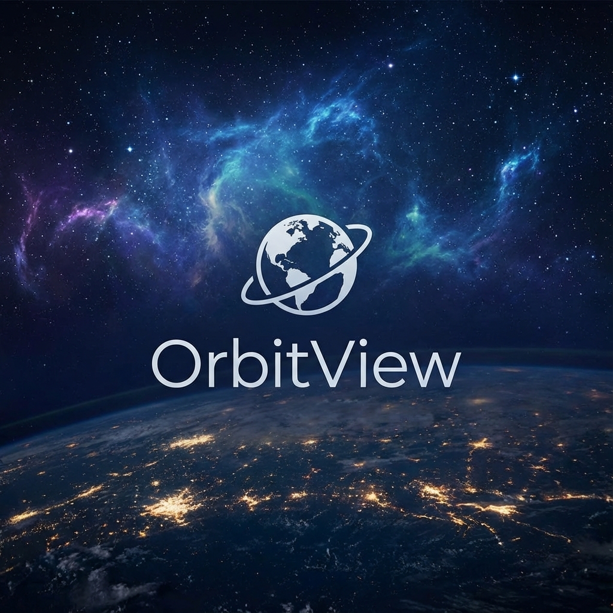
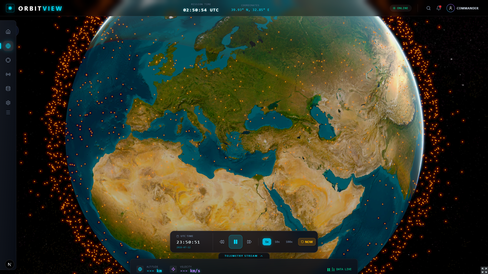
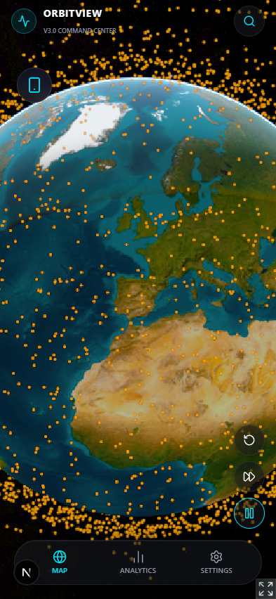

# OrbitView 🛰️

<div align="center">
  
  
  > **Advanced 3D Satellite Tracking & Orbital Mechanics Platform**  
  > Real-time visualization, pass prediction, and conjunction analysis powered by CesiumJS and SGP4.
  
  [](LICENSE)
  [](https://nextjs.org/)
  [](https://cesium.com/)
  [](https://www.typescriptlang.org/)
  [](https://orbitview-five.vercel.app)
  [](CONTRIBUTING.md)
  
  [Live Demo](https://orbit-view-interactive-3-d-space-si-steel.vercel.app/) · [Wiki](https://github.com/MeAkash77/OrbitView-Interactive-3D-Space-Situational-Awareness-Satellite-Visualization) · [Theory](THEORY.md) · [Report Bug](https://github.com/MeAkash77/OrbitView-Interactive-3D-Space-Situational-Awareness-Satellite-Visualization/issues)
</div>

---

## 📸 Showcase

| Desktop Command Center | Mobile Pocket Lab |
|:---:|:---:|
|  |  |

<div align="center">
  <p><b>Scientific Satellite Tracker & Orbital Analysis</b></p>
  <p><i>Responsive, High-Performance, and Mobile-First</i></p>
</div>

---

## ✨ Features

### 📱 v3.0 Mobile Native Evolution (NEW)
- **Pocket Lab Interface**: A native-app-like mobile UI shell (`MobileAppShell`) locked to `100dvh` to prevent browser bounce and safe-area overlap.
- **Native Snapping Sheet**: A gesture-driven bottom sheet using `framer-motion` with 3 snapping heights: Tier 1 (Preview), Tier 2 (Split Tracker), and Tier 3 (Full Scientific Lab).
- **Ankara Command Deck**: Integrated Doppler frequency shift analysis, space solar weather decay metrics, and visible overhead pass predictions relative to Ankara coordinates.
- **Haptic & Scrubber integration**: Translucent timeline play/pause controller with speed cycling and haptic triggers.
- **Hardware-Aware Profiling**: Dynamically downscales globe details and satellite load on lower-tier mobile hardware to secure 60fps rendering.

### 🎨 v3.0 ORBITAL GLASS Design System
- 🖥️ **Pure HSL Glassmorphic CSS Variables** — Frosted glass panels and neon spatial theme color tokens (uplink cyan, orbit gold) decoupled from Tailwind.
- ⏱️ **Adaptive Timeline** — Context-aware time scrubber that adjusts positions to prevent component clashing.
- 🎥 **Satellite Cockpit View (POV)** — Camera locked to the velocity vector with smooth Quaternion rotations.
- 🔬 **Scientific Modals & Bottom Sheets** — Mobile-first scientific lab cards with premium frosted backgrounds and high contrast readability.

### ⚡ v2.0 Performance
- 🛰️ **Real-time SGP4 Propagation** — Web Worker-driven batch processing for 25,000+ satellites at 60 FPS
- 🧮 **Spatial Hashing Collision Engine** — O(N) link calculation with 1000km³ grid cells
- 🌍 **High-Fidelity Inertial Orbit Rendering** — Fixed GMST algorithm shows true Kepler rings
- ⚡ **Offline-First Architecture** — IndexedDB caching with Stale-While-Revalidate
- 📦 **OTA Payload Minification** — Server-side TLE parsing and comment/whitespace stripping reduces network overhead by ~40% for mobile connections
- 📊 **Scientific Data Export** — TLE, CSV, and JSON format export for research

### 🌍 Core Features
- 🌍 **Interactive 3D Globe** — Real-time visualization of 25,000+ satellites and space objects
- 🔬 **Scientific Analysis** — Doppler shift, orbital decay, conjunction analysis, pass prediction
- 🛰️ **Professional TLE Hub** — Multi-source fallback (Space-Track, CelesTrak, AMSAT)
- ☀️ **Eclipse Detection** — Real-time sunlight/shadow status for all objects
- ⛓️ **Deep Linking** — Share specific satellites via URL (e.g., `?sat=25544`)
- ⏱️ **Time Travel** — Simulate orbits at any point in history or future
- 🔭 **Scientific Tool Suite** — Pass prediction, Skyplot polar view, Orbital decay analysis & Doppler calculator
- 🧭 **AR Compass Mode** — Use device orientation to spot satellites in the sky
- ⌨️ **Power User Tools** — Keyboard shortcuts, analyst mode, and TLE exporting
- ⭐ **Favorites System** — Save and quickly access your favorite satellites

---

## 🚀 Quick Start

### Prerequisites

- Node.js 18+ 
- npm or yarn

### Installation

```bash
# Clone the repository
git clone https://github.com/SpaceEngineerSS/OrbitVieW.git
cd orbitview

# Install dependencies
npm install

# Set up environment variables
cp .env.example .env.local
# Add your Cesium Ion access token to .env.local

# Start development server
npm run dev
```

Open [http://localhost:3000](http://localhost:3000) to see the app.

### Environment Variables

```env
NEXT_PUBLIC_CESIUM_ACCESS_TOKEN=your_cesium_token_here
```

Get your free Cesium Ion token at [cesium.com/ion](https://cesium.com/ion/).

---

## 🛠️ Tech Stack

| Technology | Purpose |
|------------|---------|
| [Next.js 15](https://nextjs.org/) | React framework with App Router & Turbopack |
| [CesiumJS](https://cesium.com/) + [Resium](https://resium.reearth.io/) | 3D globe visualization |
| [satellite.js](https://github.com/shashwatak/satellite-js) | SGP4/SDP4 orbital propagation |
| [Zustand](https://zustand-demo.pmnd.rs/) | High-performance state management |
| [Web Workers](https://developer.mozilla.org/en-US/docs/Web/API/Web_Workers_API) | Spatial Hashing physics engine |
| [TailwindCSS](https://tailwindcss.com/) | Utility-first CSS |
| [Framer Motion](https://www.framer.com/motion/) | Animations |
| [Native IndexedDB](https://developer.mozilla.org/en-US/docs/Web/API/IndexedDB_API) | Offline caching |
| [Puppeteer](https://pptr.dev/) | Automated Documentation Screenshots |

---

## 📖 Documentation

### Project Structure

```
src/
├── app/                 # Next.js App Router pages
├── components/
│   ├── Globe/          # Cesium globe & satellite rendering
│   ├── HUD/            # Heads-up display components
│   ├── Scientific/     # Analysis dashboards
│   └── layout/         # Responsive layouts (MobileNavBar, InspectorPanel)
├── lib/                # Core calculations
│   ├── DopplerCalculator.ts
│   ├── OrbitalDecay.ts
│   ├── ConjunctionAnalysis.ts
│   └── PassPrediction.ts
├── hooks/              # Custom React hooks
├── workers/            # Web Workers for heavy computation
└── store/              # Zustand state management
```

### ⌨️ Keyboard Shortcuts

| Key | Action |
|-----|--------|
| `/` | Focus search |
| `F` | Toggle favorite |
| `R` | Random satellite |
| `Space` | Toggle play/pause |
| `Escape` | Close panels |
| `?` | Show shortcuts |
| `A` | Toggle Analyst Mode |

### Scientific Features

| Feature | Description |
|---------|-------------|
| **Doppler Shift** | Calculate frequency shifts for satellite radio signals based on relative velocity |
| **Orbital Decay** | Estimate satellite lifetime using atmospheric drag models and B* coefficients |
| **Conjunction Analysis** | Analyze close approach events between space objects with risk assessment |
| **Pass Prediction** | Predict when satellites will be visible from your location with sky plots |

---

## 🌐 Data Sources

| Source | Purpose |
|--------|---------|
| **[Space-Track.org](https://space-track.org)** | Official source for 25,000+ active payload and debris TLEs |
| **[CelesTrak](https://celestrak.org)** | Secondary mirror and supplemental data provider |
| **[NASA Horizons](https://ssd.jpl.nasa.gov/horizons/)** | High-precision ephemeris for deep space missions (JWST) |
| **[SatNOGS](https://satnogs.org)** | Real-time frequency and communication metadata |

---

## 🔬 Scientific Foundation & Validation

OrbitView is engineered with high-fidelity astrodynamic models to ensure research-grade accuracy.

### Core Models
- **Propagation**: High-precision **SGP4/SDP4** models considering Earth's oblateness (J2-J4), atmospheric drag ($B^*$), and deep-space perturbations
- **Orbit Rendering**: **Fixed GMST** inertial frame rendering for true Kepler orbit visualization
- **Atmospheric Model**: Optimized exponential decay model correlated with real-time $B^*$ terms
- **Signal Analysis**: Relativistic Doppler shift calculations based on ITRF radial velocity vectors

### 📊 Validation Benchmarks

| Parameter | Modelled Accuracy | Benchmark Source | Status |
|-----------|-------------------|------------------|--------|
| **LEO Propagation** | ~1-3 km (1-day) | NAVSTAR GPS (Post-Fit) | ✅ Validated |
| **Pass Prediction** | ±5 seconds (AOS/LOS) | ISS (Zarya) TLE Observations | ✅ Validated |
| **Doppler Shift** | ±5 Hz @ 435 MHz | SatNOGS Network Telemetry | ✅ Validated |
| **Orbital Decay** | ±15% (Altitude < 400km) | NRLMSISE-00 High-Fidelity | ✅ Validated |

> For in-depth analysis and methodology, see **[THEORY.md](THEORY.md)**

---

## 🗺️ Scientific Roadmap

| Phase | Timeline | Feature |
|-------|----------|---------|
| **Phase 1** | Q1 2026 | TLE History Analysis — Track orbital changes over time |
| **Phase 2** | Q2 2026 | Maneuver Detection — Identify impulsive maneuvers via TLE residuals |
| **Phase 3** | Q3 2026 | High-Fidelity Shadow Model — Penumbra/Umbra atmospheric refraction |
| **Phase 4** | Q4 2026 | Space Weather Integration — Real-time F10.7 solar flux for dynamic density |

---

## 🧪 Testing

```bash
# Run all tests
npm test

# Run with coverage
npm run test:coverage

# Type checking
npm run type-check

# Generate Documentation Screenshots
node scripts/capture-screens.mjs
```

---

## 🤝 Contributing

Contributions are welcome! Please see [CONTRIBUTING.md](CONTRIBUTING.md) for guidelines.

1. Fork the repository
2. Create your feature branch (`git checkout -b feature/amazing-feature`)
3. Commit your changes (`git commit -m 'Add amazing feature'`)
4. Push to the branch (`git push origin feature/amazing-feature`)
5. Open a Pull Request

---

## 📄 License

This project is licensed under the MIT License - see the [LICENSE](LICENSE) file for details.

---

<div align="center">
  Made with ❤️ for space enthusiasts | v2.3.0 | Last updated: 2026-02-12
</div>
